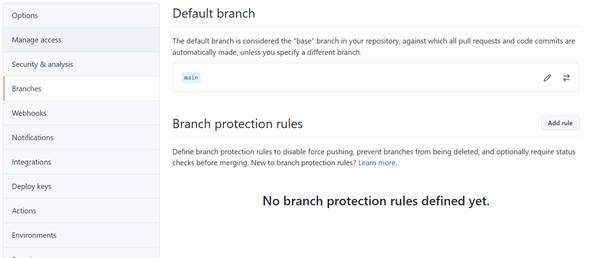
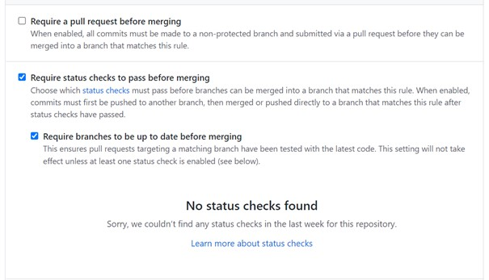
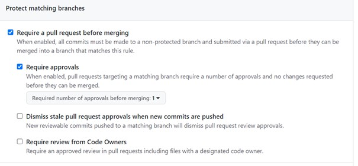

Readme file pgr301-H2021

# DEVOPS EKSAMEN H2021

### Generell info om denne readme-filen:

I denne filen så har jeg svart på spørsmålene i henhold til eksamensoppgavene. Jeg har også med forklaring på hvordan jeg løste de forskjellige oppgavene.
Jeg har tatt inspirasjon fra forelesningene og har prøvd ettet mitt beste evne å svare på oppgavene.

## Oppgave - DevOps

### Drøfting:

**DevOps som arbeidsmåte**

Når et team skal begynne på et prosjekt. Kan det være greit å sette opp før prosessen begynner med å tenke på hva slags versjonskontroll og kildekode de kan bruke. 
For å unngå at alle på teamet må ha installert alt på deres egen maskin, kan det være en god ide å bruke Docker for å lage et docker image, eller installere det de trenger for å kjøre et program på pc-en sin.
Med tanke på versjonskontroll så er det viktig å definere Trunks med en Main «line» i branch. Det betyr at man har en Main som er beskyttet med godkjenning for å komme inn i main via push.
Og man har «Dev»-brancher hvor applikasjonen blir utviklet. Med tanke på kildekode så er det greit for teamet å visualisere seg hva slags språk de skal kode i. 
Da kan utviklerne forholde seg til samme språk eller flere språk applikasjonen utvikles i.

**Utvikling**

* Spørsmål: Beskriv med ord eller skjermbilder hvordan man kan konfigurere GitHub på en måte som
gir bedre kontroll på utviklingsprosessen. Spesielt med tanke på å hindre kode som ikke
kompilerer og feilende tester fra å bli integrert i main branch.

* Spørsmål: Beskriv med ord eller skjermbilder hvordan GitHub kan konfigureres for å sikre at minst ett
annet medlem av teamet har godkjent en pull request før den merges.

**Jeg har svart på begge spm under**

Når man sikre en bedre utviklingsprosess på GitHub for å hindre at applikasjoner krasjer eller gjør noe enda verre. 
Er det bra praksis i utviklingsprosessen å ha en Main/Master branch som er protected. 
Med protected så mener jeg en utvikler for eksempel godkjenner en push fra en utviklings-branch (som vi kan kalle Dev i dette eksempelet) til Main.
Før utvikler godkjenner merge, så vil vi ha en GitHub Actions/travis eller noe annet test-program som tester programmet.
Krasjer GitHub Actions/travis så kan utvikler unngå at selve applikasjonen i Main krasjer. Dette er stegene man kan følge:

    1. Trykk på Branch under settings i ditt repo
        

    2. Trykk på add rule. Deretter «Require status check to pass before merging”
        Og her kan du velge en test som kan kjøres ved merging.

    3. For at en utvikler skal kunne godkjenne en pull request før den merges.
        Kan man trykke på «Require a pull request before merging» og velge f.eks at en godkjenning er nok.

* Spørsmål: Beskriv hvordan arbeidsflyten...

Arbeidsflyten i devops er veldig viktig. For å sikre at utviklingen har en god pipeline, så er det greit å ha en flere brancher på applikasjonen man bygger.
Der man kjører kontinuerlig med push som gjør forskjellige oppgaver et team har fått til Main som selvfølgelig har branch-protection.
Ved å følge SCRUM prinsipp så kan en hver utvikler jobbe for seg selv på egne branch som sender push videre til etter de er ferdige med oppgaven sin.

* Spørsmål: SkalBank har bestemt seg for å bruke DevOps...

Det at det er to teams er dårlig praksis. «Team Dino» har som oppgave å skrive tester, det kan gjøre at API-teamet 100% tenker at Team Dino sine tester kan klare å detektere feil i koden osv… 
Dette blir uansett et waste siden ikke «prater» sammen. Det kan også fort bli en bottleneck siden API-teamet venter på testene før de kan publisere sin løsning. 
Derfor er det enda bedre med en Single-Piece Flow hvor litt og litt kode blir pushet og testet.     

## Oppgave Pipeline

Jeg har ikke skrevet enhetstest, men har laget en pipeline som sjekker om koden kompilerer eller ikke.
Maven workflowen skal bygge en jar fil

## Oppgave - Feedback

Jeg prøvde å få med micrometer men klarte det ikke. 
Har med kode fra forelesning 8 hvor vi lærte om micrometer
Dette er ikke egen kode, men har prøvd å få det til.

## Oppgave Terraform

Terraform-oppgaven har jeg løst. Jeg har laget en S3 bucket i klassens AWS konto. 
Navnet på bucket er pgr301-!kandidatnummer!-terraform og regionen er eu-west-1

Har også konfigurert sånn at Terraform bruker S3 backend for state. ECR repository blir generert via kode.
Navnet på ECR er samme som kandidatnummer.

Jeg har med en workflow i Github Actions som sjekker Terraform i Pipeline og den funker.

* Spørsmål: Hvorfor funket terraformkoden i dette repoet for "Jens" første gang...
    

Det funket for Jens første gangen fordi han lagde «Bucket» til aws. Hver gang en annen utvikler kjører prøver å lage en bucket vil den referere til en bucket som allerede eksisterer. 
Dermed kan ikke andre utviklere lage bucket med samme navn som en annen bucket.

* Spørsmål: Sensor ønsker å lage sin bucket ved hjelp av CLI...

For at sensor skal kunne lage nøkler/Credentials. Må først sensor logge inn på sin AWS-bruker. Når sensor er inne:
Så kan han søke opp IAM i søkefeltet og inne på IAM så trykker man på Users. Deretter trykken man på ADD user og lager et brukernavn. Så er det Create User, her får man
Access Key og Secret Access Key, deretter lagre de dataene som blir skapt på AWS på notisblokk eller et sted hvor du kan finne disse lett.

* Fullfør aws s3api ...

* Sensor vil å lage en fork av ditt repo Beskriv hva sensor må gjøre etter han/hun har laget en fork for å få pipeline til å fungere for i sin AWS/gitHub konto.
* Hvilke verdier må endres i koden?

1. Det første steget er å lokalisere infra-mappen.Etter det må sensor å lage en s3bucket.tf med følgende informasjon:
       
       resource "aws_s3_bucket" "mybucket" 
       {

          bucket = "pgr301-terraform-bucket" // i " " skal man ha et valgfritt navn

       }  

2. Det Andre steget er å endre i  backend "s3" i provider.tf
        
        backend "s3" 
       {
        bucket = "pgr301-2004-terraform" // " " i " " skal man ha et valgfritt navn
        key    = "chli009/terraform_2021_pgr301_kandidat_2004.state" // navn på bruker/et valgfritt navn . state
        region = "eu-west-1" 
       }
3. Så kan man pushe/starte workflow for å starte en pipeline.

* Hvilke hemmeligheter må legges inn i repoet. Hvordan gjøres dette?

Man gjør følgende:

1. Går inn på settings/secrets på sin fork av mitt repo på Github.

2. Deretter trykker man på New repository secret:

3. I Name så skriver man:AWS_ACCESS_KEY_ID og i Value:Access key ID Så add secret

4. Samme operasjon som over, men legger til AWS_SECRET_ACCESS_KEY og i Value:Secret access key Så add secret 

## Oppgave - Docker
Jeg har skrevet en Dockerfile til dette repo'et som er inspirert fra forelesning.
Har også laget en Github Actions som bygger et Docker Image og pusher denne til ECR som ble laget i Terraform oppgaven.

* Spørsmål: Hva vil kommandolinje for å bygge et container image være? Fullfør

    Docker run -navn image

* Spørsmål: Hva vil kommando for å starte en container være? Applikasjonen skal lytte på port 7777 på din maskin. Fullfør

    Docker run -p 7777:7777 -navn image 

* Spørsmål: Medlemmer av "Team Dino" har av og til behov for å kjøre to ulike versjoner av applikasjonen...

  Docker run -p 7777:7777 -p 8888:8888 -navn image 

